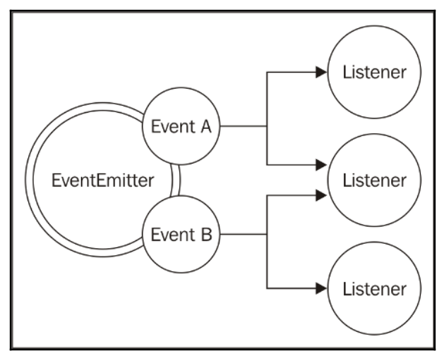
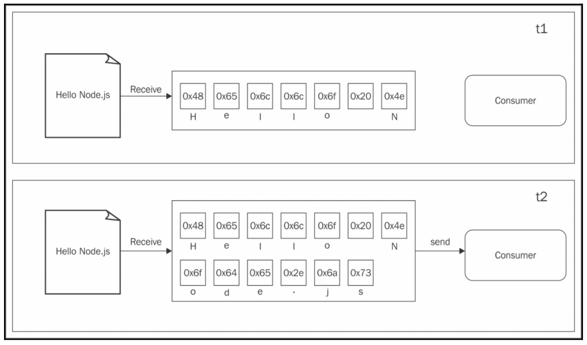
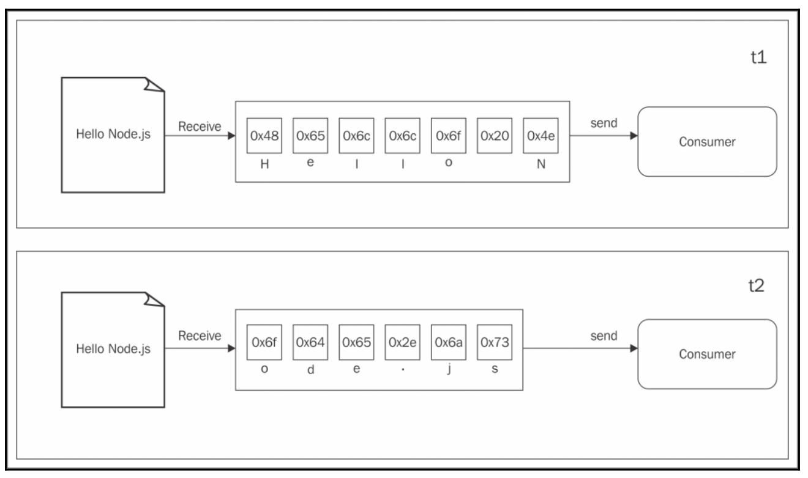
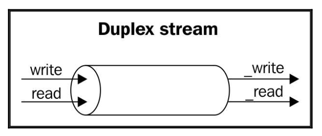
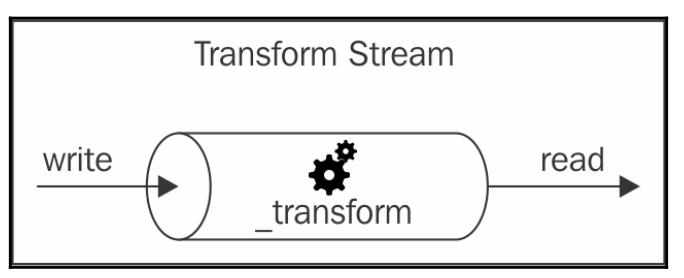

# Node's essential patterns
There are two of the most important asynchronous patterns: `callback` and `event emitter`

## The callback pattern
- handlers of the reactor pattern
- handle async operations
- to `replace` the use of `return` instruction that always executes synchronously
- `closure` is to implement the `callback`

See more [closure.js](../../closure.js)

## The continuation-passing style (CPS) pattern
- pass the argument of a function to another function
- the result is propagated by passing it to another function instead of directly returning it to the caller

See more for Sync CPS [cps.js](../../cps.js), Async CPS [async_cps.js](../../async_cps.js)

## Non-continuation-passing style callbacks
In some cases, we have to recognize that the passing style that is not a CPS callback, For instance, `map` function of the array is not a `CPS` callback
```
const result = [1, 5, 7].map(element => element - 1);
console.log(result); // [0, 4, 6]
```
That is because, the `map` function does iterate over the collection, not pass the data as argument to the function.
## An unpredictable function
One of the most dangerous situations is to have an API that behaves synchronously under certain conditions and  synchronously under others. These kinds of API are considered as `unpredictable functions`

- pattern: to use `Unleashing Zalgo` 
- prefer the direct style for `purely synchronous` functions
- changing from `sync to async` and `vice versa` requires a change to the style of all the code `using` it

The principle of avoiding `Zalgo` is to make `callback-taking APIs` to call the callbacks `either always synchronously or always asynchronously`.

`Unleashing Zalgo` pattern is saying that it should be imperative for an API to `clearly define its nature`: either `synchronous` or `asynchronous`.

See more [unpredictable_func.js](../../unpredictable_func.js)

## Deferred execution
- use `process.nextTick` to make it `purely async`
- use `setImmediate` to make it `async`

The difference between the two is that the callbacks deferred with `process.nextTick()` `run before` any other I/O event is fired, while with `setImmediate()`, the execution is `queued behind` any I/O event that is already in the queue.

See more [deferred_execution.js](../../deferred_execution.js)

## Node.js callback conventions

To understand well the CPS & Callbacks in NodeJS would help us avoid getting into [`Callback Hell`](http://callbackhell.com/)

See more [Callback Hell](../../Terms/callback_hell.md)

## Callbacks always come last
## Error always come first

We always apply the best practices in writting Node.js code using callbacks with the error coming first

```
const fs = require('fs');

const handleError = (err) => console.log('err: ' + err);
const processData = (data) => console.log('data: ' + data);

fs.readFile('foo.txt', 'utf8', (err, data) => {
    if (err)
        handleError(err);
    else
        processData(data);
});
```

See more [error_comes_first.js](../../error_comes_first.js)

## Propagating errors

In Node.js, to throw or re-throw an exception to the caller, we just simply `pass the error` object as the `first argument` of the callback function. 

See more [error_propagate.js](../../error_propagate.js)

## Uncaught exceptions
We can re-throw `naturally` the exception as 
```
const fs = require('fs');

function readJSONThrows(filename, callback) {
    fs.readFile(filename, 'utf8', (err, data) => {
        if (err) {
            return callback(err);
        }
        //no errors, propagate just the data
        callback(null, JSON.parse(data));
    });
};
```
See more [exception_rethrow.js](../../exception_rethrow.js)

We can use a `special event` - `uncaughtException` event of Node.js to catch `all uncaught exceptions` as below

```
const fs = require('fs');

process.on('uncaughtException', (err) => {
    console.error('This will catch at last the ' + 'JSON parsing exception: ' + err.message);
    // Terminates the application with 1 (error) as exit code:
    // without the following line, the application would continue
    process.exit(1);
});

function readAndProcessJsonFile(filename) {
    fs.readFile(filename, 'utf8', (err, data) => {
        if (err) {
            console.log(err);
        }
        console.log(JSON.parse(data));
    });
};
readAndProcessJsonFile('json_invalid.json');
```
See more [exception_uncaught.js](../../exception_uncaught.js)

# The module system and its patterns
Principles

```To enforce information hiding by keeping `private all the functions and variables` that are not explicitly marked to be exported```

- The essential concept to remember is that `everything inside a module is private unless it's assigned to the module.exports` variable
- JavaScript is the langage that `does not provide namespacing`
- Polluting the global scope is considered bad practice and and nullifies the advantage of having a module system
- `exports` does not expose the function, just the value. See more [exports_require.js](../../exports_require.js)
- `module.exports` expose the function. See more [module_exports_require.js](../../module_exports_require.js)
- The `require` function is synchronous
- [Dependency Hell](../../Terms/dependency_hell.md)
- module cache e.g. `require.cache`
- The CommonJS specification only allows the use of the `exports` variable to expose `public members`. See more [exports_members.js](../../exports_members.js)
- The modularity of Node.js heavily encourages the adoption of the Single Responsibility Principle (SRP): every module should have responsibility over a single functionality and that responsibility should be entirely encapsulated by the module.
- A module can modify other modules or objects in the global scope; well, this is called `monkey patching`

# The observer pattern
- In observer pattern, the `subject` would notify the changes to `multiple` observers (e.g listeners)
- In traditional continuation-passing style (`CPS`) callback will usually propagate its result to `only one` listener, the callback.

=> that's why we use `EventEmitter` to broadcast the change to multiple listeners

## The EventEmitter class



See more [event_emitter.js](../../event_emitter.js)

In some case, we have the need to make a generic object observable; this is possible by extending the `EventEmitter` class.

See more [generic_emitter.js](../../generic_emitter.js)

## Synchronous and asynchronous events

See more [async_events.js](../../async_events.js)

## EventEmitter versus callbacks
The difference between `EventEmitter` & `callbacks` is semantic: `callbacks` should be used when `a result` must be returned in an `asynchronous` way; `events` should instead be used when there is `a need to communicate` that something has just `happened`.

- `Callbacks` notify only `a particular callback` function while `EventEmitter` is possible for `multiple listeners`

## Combining callbacks and EventEmitter
There is a module called `glob` that supports the `combination` of `callbacks` & `EventEmitter`. For instance

```
const glob = require('glob');
glob('Terms/*.md', (error, files) => console.log(`All files found: ${JSON.stringify(files)}`))
    .on('match', match => console.log(`Match found: ${match}`));
```

See more [glob_require.js](../../glob_require.js)

# Stream
Streams are one of the most important components and patterns of Node.js

## Buffering vs streaming
- `Buffer mode` causes `all the data` coming from a resource to be collected into a `buffer`; it is then passed to a callback as soon as the `entire resource is read`



- `Streams` allow you to process the data `as soon as` it arrives from the resource



`Streaming` is considered in 2 manners over `Buffering`
- Spatial efficiency
    - Buffers in V8 cannot be bigger than 0x3FFFFFFF bytes (a little bit less than 1GB)
    - Big files reading
- Time efficiency

See more [gzip_buffering.js](../../gzip_buffering.js) to compress a file to Gzip format using Buffer mode to reduce size

Gzip using Streaming API see more [gzip_streaming.js](../../gzip_streaming.js)


See more [gzip_send.js](../../gzip_send.js) to `send` the `gzip` file to the server

See more [gzip_receive.js](../../gzip_receive.js) to `receive` the `gzip` file by the server from client.

## 4 base abstract classes in stream core module
- stream.Readable
- stream.Writable
- stream.Duplex
- stream.Transform

Stream supports 2 operating modes
- Binary mode: data is streamed in the form of chunks, such as buffers or strings
- Object mode: This mode is where the streaming data is treated as a sequence of discrete objects 

See more an opensource https://strongloop.com/

### Readable streams
- Reading from a stream
    - non-flowing mode
    - Flowing mode

```readable._read(size)```

```readable.push(chunk)```

See more [stream_readable.js](../../stream_readable.js) and [stream_readable_require.js](../../stream_readable_require.js)

### Writable streams
- Writing to a stream 

```writable.write(chunk, [encoding], [callback])```

```writable.end([chunk], [encoding], [callback])```

See more 
- [stream_writable.js](../../stream_writable.js) for basic writable stream
- [stream_writable_back_pressure.js](../../stream_writable_back_pressure.js) - for using back-pressure technique
- [stream_writable_to_file.js](../../stream_writable_to_file.js) and [stream_writable_to_file_require.js](../../stream_writable_to_file_require.js) - for writing streaming content to files

### Duplex streams
A Duplex stream is a stream that is both Readable and Writable



### Transform streams
The Transform streams are a special kind of Duplex stream that are specifically designed to handle data transformations.



See more [stream_transform.js](../../stream_transform.js) and [stream_transform_require.js](../../stream_transform_require.js)

To connect streams using pipes. See [stream_transform_pipe.js](../../stream_transform_pipe.js)

Joining 2 streams, you can see it in [stream_join.js](../../stream_join.js)

### Through and from for working with streams
The examples of inheriting from a base stream class violates the `small surface area` principle and requires some boilerplate code.

There are `2 libraries` used for `Transform` stream & `Readable` stream, they are `through2` & `from2`, respectively

- [`through2`](https://github.com/rvagg/through2): A tiny wrapper around Node.js streams.Transform (Streams2/3) to avoid explicit subclassing noise

- [`from2`](https://github.com/hughsk/from2): is a high-level module for creating readable streams that properly handle backpressure.
### Asynchronous control flow with streams

### Sequential execution
See more at [stream_concat_files.js](../../stream_concat_files_require.js)


### Unordered parallel execution
### Ordered parallel execution
We have a library to support the ordered parallel execution as seen here [`through2-parallel`](https://npmjs.org/package/through2-parallel)

## Piping patterns
To `merge` 2 or multiple `streams`, `split` the flow of `one stream` into two or more pipes, or `redirect` the flow `based on a condition`.

### Combining streams
A `combined stream` is usually a `Duplex` stream, which is built by connecting the `first stream to its Writable` side and the `last stream to its Readable` side.

Supported feature libraries: 
- [`duplexer2`](https://www.npmjs.com/package/duplexer2)
- [`multipipe`](https://www.npmjs.com/package/multipipe)

See more [stream_combine.js](../../stream_combine.js) and [stream_combine_require.js](../../stream_combine_require.js) 

### Forking streams
`Forking` streams is `piping a single Readable` stream into  `multiple Writable` streams

### Merging streams
`Merging` is the `opposite operation to forking` and consists of piping a `set of Readable streams` into a `single Writable` stream

#### Creating a tarball from multiple directories
- [`tar`](https://www.npmjs.com/package/tar): a streaming library to create tarballs from contents of two different directories
- [`fstream`](https://www.npmjs.com/package/fstream): a library to create object streams from filesystem files

For simply merging stream, we also have these libraries
- [`merge-stream`](https://www.npmjs.com/package/merge-stream) - very little active?
- [`multistream-merge`](https://npmjs.org/package/multistream-merge) - not active?
- [`multistream`](https://github.com/feross/multistream)
- [`combined-stream`](https://www.npmjs.com/package/combined-stream)

### Multiplexing and demultiplexing

There is a `particular variation of the merge stream` pattern in which we don't really want to just join multiple streams together but, instead, `use a shared channel to deliver` the data of a set of streams


An example using Demultiplex (e.g. demux)

